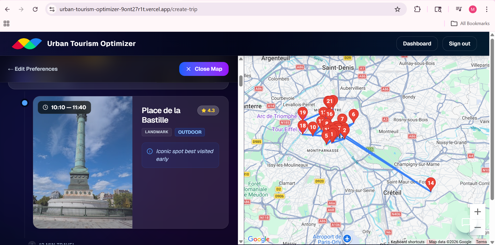
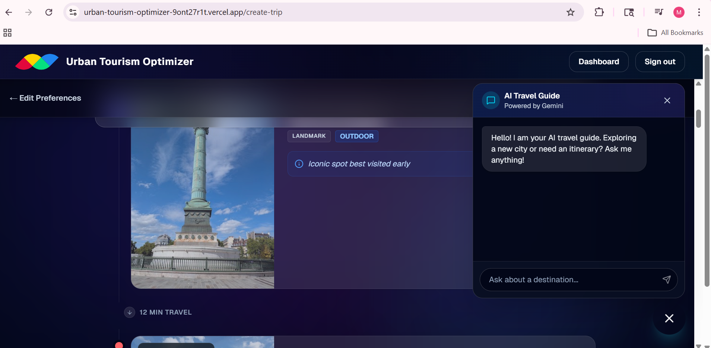

# Urban Tourism Optimizer

A full-stack intelligent travel planning system that generates structured, personalized, and weather-aware itineraries using real-time data, optimization logic, and AI-assisted interaction.

---

## Build Status


---

## Overview

Urban Tourism Optimizer addresses inefficiencies in manual trip planning by transforming user inputs into optimized itineraries. The system integrates multiple external APIs, applies normalization and scoring algorithms, and adapts plans based on environmental conditions such as weather.

---

## Features

### Intelligent Itinerary Generation

* Converts user input into structured, day-wise plans
* Applies scoring based on relevance, rating, and proximity
* Ensures realistic scheduling through time allocation logic

### Weather-Adaptive Planning

* Adjusts activities based on rainfall and temperature conditions
* Prioritizes indoor or outdoor experiences dynamically

### Multi-Source Data Integration

* Geoapify for geolocation and base place data
* Google Places for enrichment (ratings, photos, metadata)
* OpenWeather for environmental context

### AI-Assisted Chat System

* Context-aware chatbot powered by Google Gemini
* Supports itinerary modification through structured responses

### Authentication and Security

* JWT-based authentication
* Secure password handling using bcrypt
* Protected routes for user-specific data

### Performance Optimization

* Caching layer for places and weather data
* Reduced external API calls
* Efficient request handling and parallel processing

---

## System Architecture

```
Frontend (React)
        ↓
API Layer (Express Routes)
        ↓
Controller Layer
        ↓
Service Layer (Business Logic)
        ↓
External APIs + Database (MongoDB)
```

---

## Tech Stack

### Frontend

* React.js
* Context API
* State-driven UI rendering

### Backend

* Node.js
* Express.js
* MongoDB with Mongoose

### External Services

* Google Places API
* Geoapify API
* OpenWeather API
* Google Gemini API

### Utilities

* JSON Web Tokens (JWT)
* bcrypt.js
* NodeCache
* string-similarity

---

## Request Lifecycle

```
Client Request
    → API Route
    → Middleware (validation/authentication)
    → Controller
    → Service Layer
    → External API / Database
    → Data Processing
    → Response
    → UI Rendering
```

---

## Core Logic Pipeline

```
User Input
    → Geocoding
    → Data Fetching (APIs)
    → Normalization
    → Enrichment
    → Scoring & Filtering
    → Weather Adjustment
    → Slot-based Planning
    → Final Itinerary Output
```

---

## Project Structure

```
src/
│
├── config/          # Database configuration
├── controllers/     # Request handlers
├── services/        # Business logic and integrations
├── routes/          # API endpoints
├── models/          # Database schemas
├── middlewares/     # Authentication and validation
├── utils/           # Helper utilities
```

---

## Environment Variables

Create a `.env` file in the root directory:

```
PORT=5000
MONGO_URI=your_mongodb_connection_string
JWT_SECRET=your_secret_key
GEOAPIFY_API_KEY=your_key
GOOGLE_MAPS_API_KEY=your_key
OPENWEATHER_API_KEY=your_key
GEMINI_API_KEY=your_key
```

---

## Installation

```bash
# Clone repository
git clone [(https://github.com/06Pseudo06/urban-tourism-optimizer)t]

# Navigate into project
cd urban-tourism-optimizer

# Install backend dependencies
npm install

# Start backend server
npm run dev
```

---

## Screenshots

> Add application screenshots below for clarity

### Homepage


### Itinerary Output



### Chat Interface



---

## API Endpoints

### Authentication

* `POST /api/auth/register`
* `POST /api/auth/login`

### Itinerary

* `POST /api/itinerary/generate-itinerary`
* `POST /api/itinerary/save`
* `GET /api/itinerary/history`
* `GET /api/itinerary/:id`

### Places

* `POST /api/places/search`

### Chat

* `POST /api/chat`

---

## Error Handling

* Structured error responses using HTTP status codes
* Graceful handling of external API failures
* Fallback mechanisms for weather and data services

---

## Future Enhancements

* Real-time traffic-aware routing
* Advanced route optimization algorithms
* Progressive Web App support
* Multi-user collaboration features

---

## Contributors

* Frontend Development
* Backend Integration and APIs
* Core Logic and System Design

---

## License

This project is intended for academic and educational purposes.
